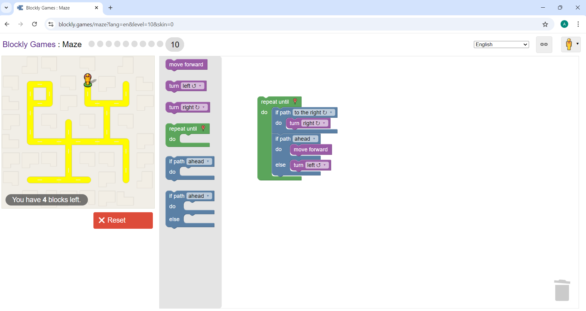
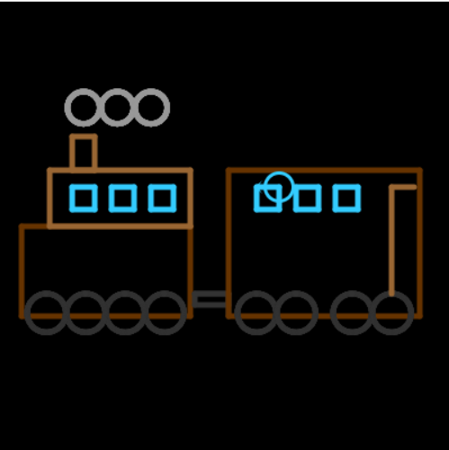
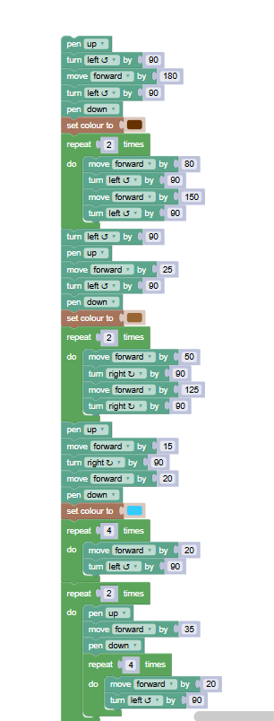
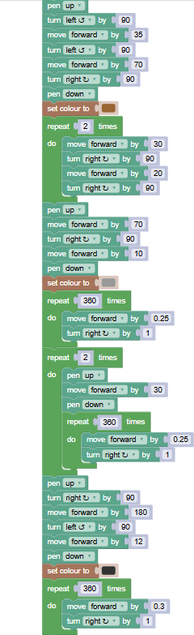
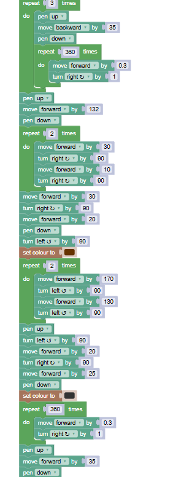
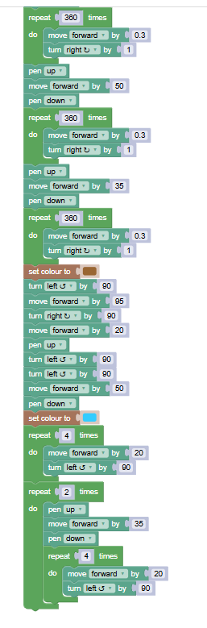

# TPC1: Blockly Games

## Andreia Machado Cardoso a107279

## Resumo
O TPC1 consistiu na realização de dois exercícios:
* Resolver o exercício 10 do Maze;
* Desenhar a figura do comboio que o professor nos deu com o Turtle.

## Resultados
* Imagem do 10 do Maze
  

* Imagem da figura do comboio
  

* Código usado para desenhar o comboio
  
    
  
  
